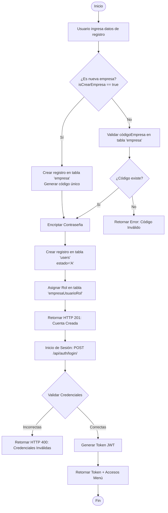
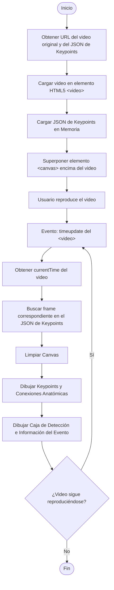

# Diagramas de Flujo del Sistema BioPose

Este documento presenta de forma visual e interactiva los flujos y procesos del backend distribuido de **BioPose**. Se utilizan diagramas en formato [Mermaid](https://mermaid.js.org/) para modelar las interacciones de los distintos componentes: Django, Django REST Framework, Celery, Redis, PostgreSQL y el Frontend.

---

## 📂 Índice de Diagramas

1. [Flujo de Registro, Autenticación y Control de Acceso (Multi-tenant)](#1-flujo-de-registro-autenticación-y-control-de-acceso-multi-tenant)
2. [Flujo de Carga y Procesamiento Asíncrono de Video (Celery + Redis)](#2-flujo-de-carga-y-procesamiento-asíncrono-de-video-celery--redis)
3. [Flujo de Visualización de Resultados en Frontend (JSON + HTML5 Canvas)](#3-flujo-de-visualización-de-resultados-en-frontend-json--html5-canvas)
4. [Flujo de Detección en Tiempo Real (Live Camera - WebSockets / SSE)](#4-flujo-de-detección-en-tiempo-real-live-camera---websockets--sse)

---

## 1. Flujo de Registro, Autenticación y Control de Acceso (Multi-tenant)

Este flujo detalla cómo se gestionan el registro de cuentas (creando una empresa o uniéndose a una existente mediante un código), la generación del token JWT al iniciar sesión y el control de accesos.

### Diagrama de Flujo (Mermaid)



### Descripción del Proceso

1. **Registro (`POST /api/auth/registerAccount/`):**
   - Si `isCrearEmpresa` es verdadero, se crea primero el registro en la tabla `empresa`, y su código único es auto-generado. El usuario se asigna como Administrador de dicha empresa.
   - Si es falso, se valida el `codigoEmpresa` provisto por el usuario. Si no existe en la base de datos, el flujo aborta con error.
   - Las contraseñas se encriptan con hashing seguro antes de guardarse en la tabla `users` (con `estado='A'` de Activo).
   - Se crea la relación en `empresaUsuarioRol` asociando al usuario con la empresa y el rol correspondiente.
2. **Inicio de Sesión (`POST /api/auth/login/`):**
   - El backend valida el correo y la contraseña contra la base de datos.
   - Si la autenticación es correcta, se genera un Token JWT y se cargan las opciones de menú que el rol asignado tiene permitidas (asociación en `rolOption` y `menuOption`).

---

## 2. Flujo de Carga y Procesamiento Asíncrono de Video (Celery + Redis)

Dado que la ejecución de algoritmos de Inteligencia Artificial (YOLOv8 + LSTM) es computacionalmente costosa y lenta, se delega esta tarea a un worker asíncrono (Celery) utilizando Redis como cola de mensajes.

### Diagrama de Arquitectura y Tareas (Mermaid)

```mermaid
graph TD
    Client[Cliente / Frontend] -->|1. POST /api/analysis/videos/upload/<br/>Sube Video MP4| Django[Django API REST]
    Django -->|2. Guarda metadatos y video| DB[(PostgreSQL)]
    Django -->|3. Retorna ID Video e IP/URL| Client
    
    Client -->|4. POST /api/analysis/videos/{id}/process/| Django
    Django -->|5. Encola tarea: process_video_task| Redis{Redis Message Broker}
    Django -->|6. Retorna HTTP 202: Aceptado/Procesando| Client
    
    Redis -->|7. Consume tarea| Celery[Celery Worker]
    
    subgraph Celery_Worker [Procesamiento IA en Celery]
        Celery -->|8. Carga modelos| Models[YOLOv8-Pose + LSTM 3-clases]
        Celery -->|9. Decodifica frames| OpenCV[Procesador de Video]
        OpenCV -->|10. Inferencia de Keypoints| YOLO[YOLOv8-Pose]
        YOLO -->|11. Clasifica actitud por secuencia| LSTM[Modelo LSTM]
        LSTM -->|12. Consolida Eventos| ReportGen[Generador de JSON de Keypoints y Reporte]
    end
    
    ReportGen -->|13. Guarda Archivo JSON de Keypoints| Storage[Almacenamiento Media/S3]
    ReportGen -->|14. Guarda registros y actualiza estado| DB
    
    Client -->|15. GET /api/analysis/videos/{id}/results/| Django
    Django -->|16. Consulta reporte y eventos| DB
    DB -->|17. Retorna datos| Django
    Django -->|18. Retorna JSON de resultados| Client
```

### Descripción del Proceso

1. **Subida:** El cliente sube el archivo original de video. Django almacena el video en `media/videos/uploads/` y crea el registro en `analysisVideoUpload` con estado `PENDING`.
2. **Encolado:** Al iniciar el procesamiento, la vista enruta la petición `process_video_task` a Redis. Inmediatamente devuelve un código HTTP `202 Accepted` al cliente con el ID de la tarea, evitando bloquear el hilo web principal de Django.
3. **Inferencia en Celery Worker:**
   - Celery extrae el video.
   - Usando OpenCV, lee los frames (aplicando saltos según `fps_skip` para optimización).
   - **YOLOv8-Pose:** Obtiene las coordenadas físicas (17 keypoints formato COCO) de cada persona en escena.
   - **Clasificador LSTM:** Procesa secuencias de 32 frames para detectar comportamientos (PELEAR, DISTURBIO, NORMAL).
4. **Almacenamiento y Reportes:**
   - Guarda un JSON ligero con todos los keypoints analizados en `media/reports/keypoints_video_<id>.json`.
   - Crea un registro en `analysisReport` y guarda los eventos clasificados en `analysisDetectionEvent`.
   - Actualiza el estado de `analysisVideoUpload` a `COMPLETED`.

---

## 3. Flujo de Visualización de Resultados en Frontend (JSON + HTML5 Canvas)

Para optimizar recursos de almacenamiento, procesamiento y red en el servidor, **no** se genera un video MP4 editado. El backend entrega el video original limpio junto con el JSON de keypoints y es el navegador cliente quien dibuja el esqueleto anatómico dinámicamente.

### Diagrama de Sincronización en Cliente (Mermaid)



### Descripción del Proceso

1. **Precarga:** El frontend consume `/api/analysis/videos/{id}/results/` y `/api/analysis/videos/{id}/keypoints-json/` para obtener las rutas del video original y las posiciones de pose.
2. **Sincronización:** Mediante Javascript, el navegador captura el evento `timeupdate` de la reproducción del video para rastrear los milisegundos exactos del reproductor.
3. **Renderizado Vectorial:** El navegador mapea el segundo actual con el fotograma correspondiente dentro del JSON en memoria. En milisegundos, limpia el Canvas y dibuja las líneas de los huesos anatómicos (esqueletos) y las alertas de peligro (pelea o disturbio) de forma fluida.

---

## 4. Flujo de Detección en Tiempo Real (Live Camera - WebSockets / SSE)

Para el análisis de transmisiones en vivo (como cámaras de seguridad en tiempo real o Webcams locales), el sistema cuenta con dos canales alternativos: WebSockets bidireccionales y Server-Sent Events (SSE) unidireccionales.

### Diagrama de Flujo de Tiempo Real (Mermaid)

```mermaid
sequenceDiagram
    autonumber
    actor Cliente as Navegador (Cliente)
    participant Django as Django ASGI / Channels
    participant IA as Servicios IA (YOLO + LSTM)
    
    rect rgb(20, 30, 40)
        Note over Cliente, Django: Opción A: WebSockets (ws://live-detection/)
        Cliente->>Django: Conexión Handshake WebSocket
        Django-->>Cliente: Conexión Aceptada
        loop Transmisión de Cuadros
            Cliente->>Django: Envía Frame de Cámara (Base64) + fps_skip + mode
            Django->>IA: Envía frame descodificado
            IA->>IA: Ejecuta YOLOv8 (Pose) + LSTM (Comportamiento)
            IA-->>Django: Devuelve Bounding Boxes, Keypoints y Clasificación
            Django-->>Cliente: Envía JSON (frame procesado + keypoints + alertas)
            Note over Cliente: Dibuja Keypoints en vivo sobre la webcam
        end
    end

    rect rgb(30, 20, 40)
        Note over Cliente, Django: Opción B: Server-Sent Events (GET /api/analysis/live/stream/)
        Cliente->>Django: Petición HTTP GET (Conexión persistente SSE)
        Django-->>Cliente: Cabecera: Content-Type: text/event-stream
        loop Envío unidireccional
            Django->>IA: Captura frame desde fuente RTSP/Cámara del servidor
            IA->>IA: Inferencia YOLO + LSTM
            IA-->>Django: Metadatos del análisis
            Django-->>Cliente: Transmite evento SSE (data: base64 frame + keypoints)
        end
    end
```



### Descripción del Proceso

* **Vía WebSockets (Detección Interactiva):**
  - El navegador abre una conexión persistente a `ws://<servidor>/ws/live-detection/`.
  - El frontend envía frames en Base64 de la webcam del cliente continuamente.
  - El backend (Django Channels) recibe el socket, ejecuta la inferencia de manera rápida en los servicios IA y responde de vuelta con los esqueletos y predicciones para renderizado rápido.
* **Vía Server-Sent Events (SSE):**
  - Diseñado principalmente para cámaras IP centralizadas (URL RTSP alimentada al servidor).
  - El servidor se encarga de decodificar el flujo de video, pasar los cuadros por YOLO/LSTM, y enviar los frames procesados en un canal persistente unidireccional HTTP hacia el frontend.
